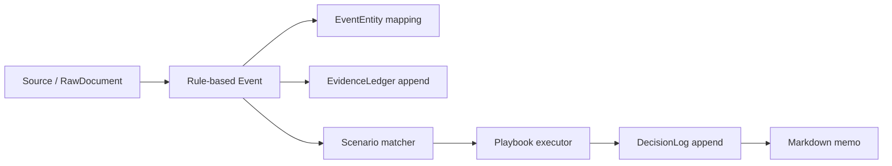

# Architecture

## Flow

Raw inputs become events, events become evidence, evidence is matched against
scenarios, and scenarios produce decision-support logs. The decision log records
risk-review actions such as `no_new_buy` or `review_partial_derisking`; it never
records broker orders.

## Daily Sentinel

The Daily Sentinel reviews recorded events, appends evidence rows for the thesis
review trail, appends a daily decision-support log, and renders a markdown risk
memo. It is intended for close-of-day human review.

## Intraday Emergency Sentinel

The Intraday Emergency Sentinel accepts a single urgent event plus current
metrics and exposure context. It computes the Emergency Impact Score, matches
YAML scenarios, executes playbooks, appends trigger/evidence/decision records,
and returns allowed and forbidden risk actions.

## Lifecycle

Theses, scenarios, and playbooks are versioned YAML files. A thesis can move
through states such as `watch`, `active`, `deteriorating`, or `invalidated`, but
state changes should be justified by evidence and decision logs. Scenarios are
triggered by explicit metric conditions. Playbooks are activated only by scenario
matches and emergency levels.

## Append-Only Audit Principle

`EvidenceLedger` and `DecisionLog` rows are append-only in the MVP. The code
provides create/list helpers, not update helpers, so prior reasoning remains
auditable.
