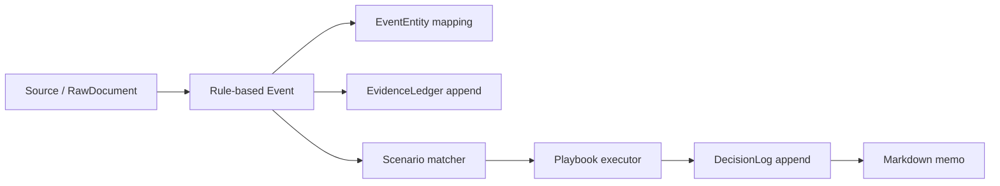

# Architecture

## Flow

Raw inputs become events, events become evidence, evidence is matched against
scenarios, and scenarios produce decision-support logs. The decision log records
risk-review actions such as `no_new_buy` or `review_partial_derisking`; it never
records broker orders.

## Data Input Layer

Official collectors share a common contract: `collector_id`, `source_id`,
`fetch_raw`, `normalize`, and `ingest`. `fetch_raw` returns typed collector raw
schemas, `normalize` returns internal create schemas, and `ingest` writes through
repository methods. Mock mode reads local fixtures and does not require API keys.
Real fetch paths are placeholders that raise clear configuration errors when
required API keys are absent.

OpenDART and News/RSS items enter `RawDocument` first. ECOS and FRED records
enter `IndicatorObservation`. KRX records enter `MarketTimeSeries`. All collector
records carry `collected_at` and `available_from`; repository writes enforce that
`available_from` is not earlier than known publication, release, timestamp, or
collection times.

## Normalization Layer

The event normalization layer converts collected records into normalized
investment events:

- `RawDocument` from OpenDART and News/RSS becomes disclosure or headline events.
- `IndicatorObservation` from ECOS and FRED becomes macro release or surprise events.
- `MarketTimeSeries` from KRX or future market sources becomes large-move events
  when prior observations and threshold rules allow deterministic detection.

Normalizers are rule-based and deterministic. They do not call LLMs, external
APIs, broker systems, or paid services. Each normalized event records
`event_time`, `first_seen_at`, and `available_from`; `available_from` is carried
forward from the source record and must not be earlier than that source record's
availability time.

Duplicate prevention happens before inserts. The MVP skips events generated from
the same source record, skips News/RSS duplicates by checksum, and skips close
duplicates when the event type, mapped entity, and timestamp window overlap.

## Daily Sentinel

The Daily Sentinel reviews recorded events, appends evidence rows for the thesis
review trail, appends a daily decision-support log, and renders a markdown risk
memo. It is intended for close-of-day human review.

## Intraday Emergency Sentinel

The Intraday Emergency Sentinel accepts a single urgent event plus current
metrics and exposure context. It computes the Emergency Impact Score, matches
YAML scenarios, executes playbooks, appends trigger/evidence/decision records,
and returns allowed and forbidden risk actions.

## Scenario Matching

Scenario triggers support `any_of`, `all_of`, and `min_score` modes. Required
conditions act as gates, optional conditions contribute to the match score and
diagnostic output, and legacy `any_of` YAML continues to load. The matcher treats
missing, `null`, and malformed metric values as explicit non-matches rather than
runtime failures.

## Lifecycle

Theses, scenarios, and playbooks are versioned YAML files. A thesis can move
through states such as `watch`, `active`, `deteriorating`, or `invalidated`, but
state changes should be justified by evidence and decision logs. Scenarios are
triggered by explicit metric conditions. Playbooks are activated only by scenario
matches and emergency levels.

## Append-Only Audit Principle

`EvidenceLedger` and `DecisionLog` rows are append-only in the MVP. The code
provides append/list helpers, not update/delete helpers, so prior reasoning
remains auditable. ORM guards reject direct update or delete attempts on these
audit rows; corrections should be appended as new records with their own
rationale.
