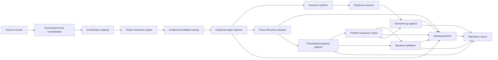

# Architecture

## Flow

Raw inputs become normalized events, events become thesis-linked evidence
candidates, evidence is matched against scenarios, and scenarios produce
decision-support logs. The decision log records risk-review actions such as
`no_new_buy` or `review_partial_derisking`; it never records broker orders.

## Data Input Layer

Official collectors share a common contract: `collector_id`, `source_id`,
`fetch_raw`, `normalize`, and `ingest`. `fetch_raw` returns typed collector raw
schemas, `normalize` returns internal create schemas, and `ingest` writes through
repository methods. Mock mode reads local fixtures and does not require API keys.
Real fetch paths are placeholders that raise clear configuration errors when
required API keys are absent.

OpenDART and News/RSS items enter `RawDocument` first. ECOS and FRED records
enter `IndicatorObservation`. KRX records enter `MarketTimeSeries`. All collector
records carry `collected_at` and `available_from`; repository writes enforce that
`available_from` is not earlier than known publication, release, timestamp, or
collection times.

## Normalization Layer

The event normalization layer converts collected records into normalized
investment events:

- `RawDocument` from OpenDART and News/RSS becomes disclosure or headline events.
- `IndicatorObservation` from ECOS and FRED becomes macro release or surprise events.
- `MarketTimeSeries` from KRX or future market sources becomes large-move events
  when prior observations and threshold rules allow deterministic detection.

Normalizers are rule-based and deterministic. They do not call LLMs, external
APIs, broker systems, or paid services. Each normalized event records
`event_time`, `first_seen_at`, and `available_from`; `available_from` is carried
forward from the source record and must not be earlier than that source record's
availability time.

Duplicate prevention happens before inserts. The MVP skips events generated from
the same source record, skips News/RSS duplicates by checksum, and skips close
duplicates when the event type, mapped entity, and timestamp window overlap.

## Evidence Generation Layer

The evidence generation layer converts normalized `Event` plus `EventEntity`
rows into thesis-linked `EvidenceCandidate` records. It is deterministic and
rule-based:

- Relevance matching compares event entity IDs, entity types, thesis metadata,
  scenario metadata, keywords, and trigger-related hints.
- Stance classification returns only `supports`, `contradicts`, or `neutral`.
- Strength scoring uses bounded event scores, relevance, and event-type severity
  on a 0 to 5 scale.
- Scenario linkage attaches `scenario_id` when the event type or trigger-related
  metadata matches a scenario for the same thesis.

Appending candidates writes new `EvidenceLedger` rows only. Duplicate evidence
for the same `event_id`, `thesis_id`, `scenario_id`, and `evidence_type` is
skipped, and metadata records the mapped entities plus relevance reasons. The
layer does not call LLMs, external APIs, broker systems, or paid services.

## Thesis Lifecycle Layer

The thesis lifecycle layer aggregates accumulated `EvidenceLedger` rows by
`thesis_id` and proposes the next thesis state. It reads thesis YAML, latest
prior snapshots, optional Big Flow scores, and invalidation conditions.
Supportive evidence raises `support_score`, contradicting evidence raises
`contradiction_score` and `risk_score`, and neutral evidence is counted without
strongly moving state.

Transitions are deterministic recommendations. Examples include `watch` to
`active` when support is strong and contradiction is low, `active` to
`deteriorating` when contradictions rise, and `deteriorating` or `suspended` to
`invalidated` when strong invalidation evidence appears. `invalidated` does not
automatically archive; `archived` snapshots are created only by explicit archive
command.

`ThesisStateSnapshot` rows are append-only. Repeated evaluation for the same
`as_of` and identical evidence/scoring fingerprint skips duplicate snapshots
unless a force flag is used.

## Portfolio Review Layer

The portfolio review layer reads a local holdings fixture and YAML portfolio
configuration. It calculates deterministic exposure ratios for cash, themes,
theses, sectors, single assets, high-beta holdings, and foreign currencies.

Portfolio review uses the latest `ThesisStateSnapshot` by thesis ID. It emits
review flags such as `under_exposed_review`, `reduce_risk_review`,
`crowding_review`, `over_exposed_review`, `concentration_warning`, and
`missing_thesis_state_warning`. These are human review prompts only, not orders
or trade instructions. Each review appends a `portfolio_review` DecisionLog row
with exposure breakdown and risk flags, then renders a portfolio memo.

## Backtest Validation Layer

The validation layer replays deterministic fixture returns against historical
thesis state signals, portfolio review flags, and point-in-time portfolio
snapshots. It supports review-only simulation policies such as static portfolio,
benchmark buy-and-hold, thesis-state risk overlay, and portfolio-flag overlay.

Signals are only eligible when `available_from` is on or before the simulated
decision date. Future-available signals raise or warn before simulation and are
ignored until they become available. Performance metrics and diagnostic
usefulness metrics are written to markdown reports. The layer never creates
live orders, broker execution payloads, or LLM-directed investment decisions.

## Dashboard Layer

The dashboard layer is a local Streamlit read surface over SQLite rows and
markdown artifacts. Query helpers in `project_stock.dashboard.queries` summarize
table counts, recent events, evidence by thesis and stance, latest thesis state
snapshots, portfolio review DecisionLog metadata, scenario trigger logs,
emergency review metadata, and latest backtest report artifacts.

The dashboard performs no ingestion, no external API calls, and no broker
integration. Empty tables return empty sections instead of runtime failures.

## Daily Sentinel

The Daily Sentinel reviews recorded events, appends evidence rows for the thesis
review trail, appends a daily decision-support log, and renders a markdown risk
memo. It is intended for close-of-day human review.

## Intraday Emergency Sentinel

The Intraday Emergency Sentinel accepts a single urgent event plus current
metrics and exposure context. It computes the Emergency Impact Score, matches
YAML scenarios, executes playbooks, appends trigger/evidence/decision records,
and returns allowed and forbidden risk actions.

## Operational Review Loops

The operational service layer connects the MVP components into review workflows:

- Daily review: register sources, optionally ingest the offline official mock
  bundle, normalize events, append deduplicated evidence, derive deterministic
  review metrics from events/evidence, match scenarios, evaluate playbooks at
  review-only emergency level, append a `daily_review` DecisionLog row, and
  render a daily memo.
- Intraday review: create or reuse a stable emergency event, map entities,
  append deduplicated evidence candidates for that event, merge explicit metrics
  with event/evidence hints, match scenarios, score EIS, execute playbooks,
  append an `emergency_risk_review` DecisionLog row, and render an emergency
  memo.

Repeated daily runs skip duplicate source records, normalized events, and
evidence. Repeated intraday runs against the same emergency fixture reuse the
same event lineage and skip duplicate evidence. DecisionLog entries remain
append-only and can be repeated to show each operational review pass.

The thesis review workflow runs after evidence accumulation and creates
append-only thesis state recommendations plus a thesis review memo.

The portfolio review workflow can run after thesis review, turning current
thesis states plus fixture holdings into exposure review flags and a portfolio
review memo.

The backtest validation workflow runs independently from live data ingestion. It
loads fixture market returns and point-in-time signals, computes benchmark and
overlay policy metrics, and renders a validation report.

The dashboard workflow runs after any demo or operational review. It reads the
same SQLite database and memo directory to visualize outputs for human review.

## Scenario Matching

Scenario triggers support `any_of`, `all_of`, and `min_score` modes. Required
conditions act as gates, optional conditions contribute to the match score and
diagnostic output, and legacy `any_of` YAML continues to load. The matcher treats
missing, `null`, and malformed metric values as explicit non-matches rather than
runtime failures.

## Lifecycle

Theses, scenarios, and playbooks are versioned YAML files. A thesis can move
through states such as `watch`, `active`, `deteriorating`, or `invalidated`, but
state changes should be justified by evidence and decision logs. Scenarios are
triggered by explicit metric conditions. Playbooks are activated only by scenario
matches and emergency levels.

## Append-Only Audit Principle

`EvidenceLedger`, `DecisionLog`, and `ThesisStateSnapshot` rows are append-only
in the MVP. The code provides append/list helpers, not update/delete helpers, so
prior reasoning remains auditable. ORM guards reject direct update or delete
attempts on these audit rows; corrections should be appended as new records with
their own rationale.
